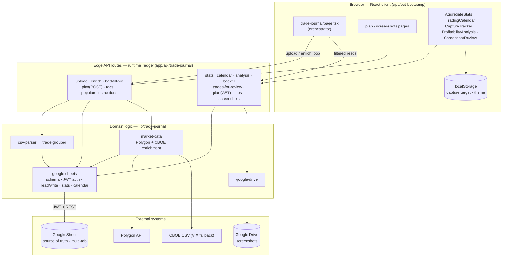
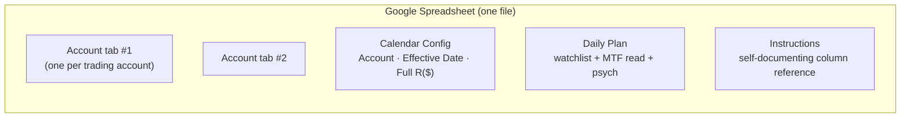
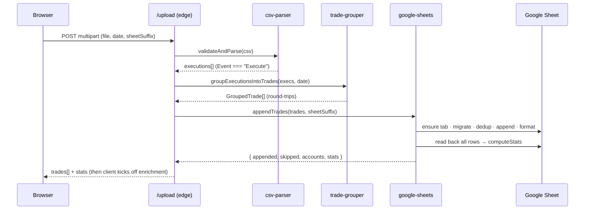
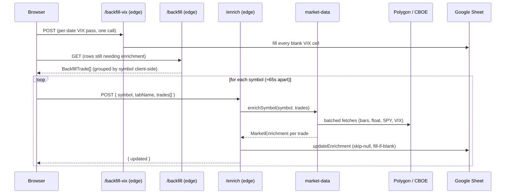
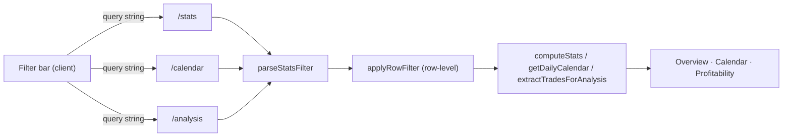

# PCT Bootcamp — Auto Trade Journal

A serverless trading journal that turns a **DAS Trader CSV export** into annotated,
enriched round-trip trades and analytics — using a **Google Sheet as its database**.
It runs entirely on the Cloudflare Pages **edge runtime** as part of the larger
TapeReader Next.js app.

> **Scope of this document.** Design, architecture, workflows, and a full API
> reference. It is intentionally implementation-accurate. Concrete identifiers
> (spreadsheet ID, Drive folder IDs, service-account details, real account-tab
> names) are replaced with placeholders — see [Configuration & identifiers](#configuration--identifiers).

---

## ⭐ Quick reference (start here)

### Key actions & workflows

| Workflow | What it does | Entry point |
|---|---|---|
| **Upload** | Parse a DAS CSV → group fills into round-trip trades → append to the sheet | `POST /api/trade-journal/upload` |
| **Enrich** | Attach market-data indicators to a symbol's trades (Polygon) | `POST /api/trade-journal/enrich` |
| **Backfill** | Find rows missing enrichment and fill them (client-paced loop) | `GET /api/trade-journal/backfill` → loop `enrich` |
| **Backfill VIX** | One fast per-date pass filling every blank VIX cell | `POST /api/trade-journal/backfill-vix` |
| **Performance overview** | Aggregate stats + the prediction/execution skill funnel | `GET /api/trade-journal/stats` |
| **Trading calendar** | Per-day P&L / R cells with drill-down | `GET /api/trade-journal/calendar` |
| **Profitability analysis** | Raw per-trade R + MFE for partial-strategy simulation | `GET /api/trade-journal/analysis` |
| **Screenshot review** | Join trades with Drive screenshots; edit retrospective tags | `GET /api/trade-journal/trades-for-review` + `screenshots` + `PATCH tags` |
| **Morning plan** | Pre-market watchlist + conviction + psych check-in | `GET`/`POST /api/trade-journal/plan` |

### API at a glance

| Method | Endpoint | Purpose |
|---|---|---|
| `POST` | `/api/trade-journal/upload` | Ingest a DAS CSV into round-trip trades |
| `POST` | `/api/trade-journal/enrich` | Enrich one symbol's trades with market data |
| `GET` | `/api/trade-journal/backfill` | List rows still needing enrichment |
| `POST` | `/api/trade-journal/backfill-vix` | Fill blank VIX cells (per-date) |
| `GET` | `/api/trade-journal/stats` | Aggregate stats + skill funnel |
| `GET` | `/api/trade-journal/calendar` | Per-day calendar cells |
| `GET` | `/api/trade-journal/analysis` | Per-trade R + MFE + MAE |
| `GET` | `/api/trade-journal/trades-for-review` | Trades + tags for screenshot review |
| `PATCH` | `/api/trade-journal/tags` | Update one trade's retrospective tags |
| `GET` | `/api/trade-journal/plan` | Read the Daily Plan for a date |
| `POST` | `/api/trade-journal/plan` | Upsert the Daily Plan for a date |
| `GET` | `/api/trade-journal/tabs` | List account tabs |
| `GET` | `/api/trade-journal/screenshots` | Screenshot index (entry/EOD) |
| `GET` | `/api/trade-journal/screenshot-image` | Proxy image bytes for a Drive file |
| `POST` | `/api/trade-journal/populate-instructions` | (Re)write the Instructions tab |

---

## Table of contents

- [What this is](#what-this-is)
- [Architecture](#architecture)
- [Repository layout](#repository-layout)
- [Data model — the sheet is the database](#data-model--the-sheet-is-the-database)
- [Core workflows (with diagrams)](#core-workflows-with-diagrams)
- [Key domain concepts](#key-domain-concepts)
- [API reference](#api-reference)
- [Configuration & identifiers](#configuration--identifiers)
- [Environment variables](#environment-variables)
- [Local development, build & deploy](#local-development-build--deploy)

---

## What this is

A trader exports their fills from **DAS Trader** as a CSV. The journal:

1. **Parses** the CSV and keeps only executed fills.
2. **Groups** those fills into round-trip trades via position tracking (a trade is
   complete when the running position returns to zero).
3. **Appends** the trades to a per-account tab in a shared Google Sheet, de-duplicated
   and formatted.
4. **Enriches** each trade with market-data context from Polygon (opening range,
   ATR, RVOL, VWAP distance, max favorable/adverse excursion, the trade-date daily
   candle, VIX, and more).
5. **Analyzes** the accumulated rows: aggregate stats, a prediction/execution **skill
   funnel**, a trading calendar, partial-exit profitability simulation, and a
   screenshot review workflow with retrospective tagging.

The trader can also edit the sheet by hand — manual columns (Setup, Notes, Conviction,
Risk, Tags, …) sit alongside the auto-filled ones.

---

## Architecture

The defining decision: **there is no database.** A Google Sheet is the source of
truth for storage, schema, *and* configuration, and doubles as a hand-editable UI.
Every API route is a **stateless edge function** that reads a tab, transforms it in
memory, and writes back.



**Layers, one responsibility each:**

- **Client** — the trade-journal page is an *orchestrator*: it drives upload, loops
  enrichment per symbol, and fans filtered reads to the presentational components.
  Per-device prefs live in `localStorage`.
- **Edge routes** — thin controllers. Validate input, delegate to a domain function,
  shape the JSON. No business logic. Stateless between requests.
- **Domain** (`lib/trade-journal`) — the real system. `google-sheets.ts` is the spine
  (schema, auth, reads/writes, stats, calendar); `market-data.ts` owns enrichment;
  `csv-parser` + `trade-grouper` are the ingest pipeline; `google-drive.ts` handles
  screenshots.
- **External** — Google Sheets (data + config), Drive (screenshots), Polygon (market
  data) with a CBOE CSV fallback for VIX. All reached with raw `fetch` (no vendor SDKs
  — the edge runtime has no Node APIs).

### Why the edge runtime shapes everything

- **No `googleapis` SDK** (needs Node `crypto`/`http`) → all Google calls are raw
  `fetch` against the REST API.
- **Auth is a service-account JWT** signed with the **Web Crypto API**
  (`crypto.subtle`, RS256); the same OAuth token serves both Sheets and Drive.
- **Stateless** — anything that must persist lives in the Sheet (shared truth) or in
  `localStorage` (per-device prefs).

---

## Repository layout

There is no single "trade journal" folder — it's a subsystem spread across four
directories inside the `web/` Next.js app:

```
web/
├── app/
│   ├── pct-bootcamp/trade-journal/     # Pages (client, App Router)
│   │   ├── page.tsx                    #   main journal (upload + views orchestrator)
│   │   ├── plan/page.tsx               #   Morning Plan form
│   │   └── screenshots/page.tsx        #   Screenshot Review
│   └── api/trade-journal/              # Edge API routes (one folder per endpoint)
├── components/trade-journal/           # Presentational React components
│   ├── AggregateStats.tsx  TradingCalendar.tsx  CaptureTracker.tsx
│   ├── ProfitabilityAnalysis.tsx  ScreenshotReview.tsx  TradePreview.tsx  …
└── lib/trade-journal/                  # Domain logic (no React)
    ├── csv-parser.ts                   #   validate DAS CSV, keep executions
    ├── trade-grouper.ts                #   group fills → round-trip trades
    ├── google-sheets.ts               #   schema, auth, read/write, stats, calendar
    ├── market-data.ts                  #   Polygon + CBOE enrichment
    └── google-drive.ts                 #   screenshot index + image proxy
```

---

## Data model — the sheet is the database

The spreadsheet is **multi-tab**. Alongside the trade data, config lives in the same
surface (config-as-data, edited by hand):



- **Account tabs** — one per trading account (matched by account prefix, e.g.
  `<ACCOUNT_TAB>`). One row per round-trip trade, ~73 columns.
- **Calendar Config** — the Full-R risk schedule over time (`Account | Effective Date
  | Full R($)`), applied by latest effective date ≤ trade date, so changing risk units
  doesn't retroactively rescale history.
- **Daily Plan** — the pre-market watchlist filled by the Morning Plan form; also the
  source for auto-filled Origin / Conviction / MTF read / psych columns at upload.
- **Instructions** — a generated column reference so the sheet is self-documenting.

### Column groups on an account tab

| Group | Examples | Filled by |
|---|---|---|
| Auto (from CSV) | Date, Entry/Exit Time, Symbol, Side, Shares, Avg Entry/Exit, # Partials, P&L | Upload |
| Formula | Stop, P&L (R), 1R–6R | Sheet formulas |
| Per-trade manual | R (Risk), Setup, Process Followed?, Notes, Conviction, Catalyst, Tags | Trader |
| Daily manual | Sleep Score, Readiness Score, Market Bias | Trader |
| Daily psych (auto from plan) | Energy, Tension, Urge to Trade Fast? | Morning Plan |
| Origin / MTF (auto from plan) | Origin, L2 Bias, Daily/1H/5m Trend + Conv | Morning Plan |
| Market enrichment | #1m/#5m/#1H, %Gap, %ATR, RVOL, %VWAP, OR fields, Max R Before Stop, MAE (R), SMAs, Float, SPY Dir, VIX, PDC/PDH/PDL | Enrich |
| Daily candle + volatility | O, H, L, C, V, ATR, 30mATR | Enrich |

**Schema resilience.** Columns are resolved by **header name** at read time
(`buildColMap`), never by fixed position — so the trader can reorder columns freely.
New headers append to the end of the canonical list; a migration step appends any
missing columns to each tab. This header-name mapping is effectively the system's ORM.

---

## Core workflows (with diagrams)

### 1) Upload — CSV → rows



Grouping is a **position state machine**: Buy `+shares`, Sell/Shrt `−shares`; when the
running position returns to **0**, one round-trip is complete. Scaling in and out
collapse into a single trade. De-dup key is `Date|Symbol|normalizedEntryTime|Side`.

### 2) Enrichment / backfill — paced by a rate limit

Polygon's free tier allows **5 requests/min**, and each symbol costs ~5 requests. So
the **client is the pacer**: it fetches the worklist, then loops symbols with a delay.



Idempotent by design: `updateEnrichment` skips null fields (never clobbers existing or
manual cells), and the worklist only includes rows that actually need work — so the
Backfill button is safe to press repeatedly.

### 3) Reads — one shared filter, three views



The filter is parsed and applied identically across the three read paths (no drift),
at the **row level before any computation** — so every downstream metric (win rate,
calendar cells, the skill funnel) inherits it automatically.

---

## Key domain concepts

- **Round-trip grouping** — a trade spans from a fill that opens a position to the fill
  that returns it to zero; multiple entries/exits collapse into one trade.
- **Blank vs `N/A` vs value** — a cell is three-state: *blank* = "not enriched yet"
  (retry), literal *`N/A`* = "impossible to compute" (ticker too young; don't retry),
  a *value* = done. Parsers treat blank and `N/A` as null.
- **Max R Before Stop (MFE)** — order-aware: walks 1-min bars from entry, tracks the
  max favorable R-multiple, stops accruing if the stop is hit.
- **MAE (R)** — max adverse excursion over the actual holding window (entry→exit),
  stored negative.
- **Prediction & Execution skill funnel** (in `/stats`): favorable move beyond the open
  (long `H−O`, short `O−L`) vs pre-open ATRs —
  **Intra-Day Prediction %** (≥ 1× `30mATR`) → **Daily Prediction %** (≥ 0.8× `ATR`,
  with 1.0× as "strong read") → **Execution %** (Target Capture, among trades whose
  MFE reached the target). The capture target is client-supplied.
- **Origin** — idea source (`Watchlist / Callout / Intraday discovery`), auto-derived
  from whether a symbol was on the Daily Plan; kept separate from execution discipline.

---

## API reference

**Base URL** — the app's deployment host (a Cloudflare Pages domain). Examples below
use **relative paths**.

**Conventions**
- Content type is JSON unless noted; `/upload` takes `multipart/form-data`;
  `/screenshot-image` returns image bytes.
- Errors are `{ "error": "message" }` with an appropriate HTTP status
  (`400` bad input, `404` tab not found, `500` upstream/other).
- `<ACCOUNT_TAB>` is a placeholder for a real account-tab name.

### Shared query parameters (filters)

Used by `/stats`, `/calendar`, and `/analysis`:

| Param | Type | Notes |
|---|---|---|
| `tab` | string (**required**) | Account tab name |
| `processFollowed` | `yes` \| `no` | Exact match on Process Followed? |
| `startDate`, `endDate` | `YYYY-MM-DD` | Ignored by `/calendar` (it uses month nav) |
| `setup`, `conviction`, `side`, `symbol` | string | Exact match |
| `catalyst`, `tags` | string | "Contains" match (cells are comma-separated) |
| `target` | number | `/stats` only — capture target for Execution % (default `2.5`) |

---

### `POST /api/trade-journal/upload`

Ingest a DAS CSV into round-trip trades.

**Request** — `multipart/form-data`

| Field | Type | Notes |
|---|---|---|
| `file` | File (`.csv`) | DAS export (headers: Event, B/S, Symbol, Shares, Price, Route, Time, Account, Note) |
| `date` | `YYYY-MM-DD` | Trade date (defaults to today ET) |
| `sheetSuffix` | string | Optional tab-name suffix |

**Response** `200`
```json
{
  "success": true,
  "date": "2026-05-06",
  "tradesProcessed": 3,
  "rowsAppended": 3,
  "rowsSkipped": 0,
  "accounts": ["<ACCOUNT_TAB>"],
  "sheetGid": 123456,
  "stats": { "totalPnl": 0, "...": "AggregateStats (see /stats)" },
  "trades": [
    { "index": 0, "symbol": "SMCI", "side": "Long", "shares": 300,
      "avgEntry": 32.21, "avgExit": 33.10, "pnl": 267.0, "numPartials": 5,
      "durationMins": 3.9, "entryTime": "9:30:46", "exitTime": "9:34:37",
      "date": "2026-05-06" }
  ]
}
```

---

### `POST /api/trade-journal/enrich`

Enrich one symbol's trades with market data and write them back.

**Request** — `application/json`
```json
{
  "symbol": "SMCI",
  "tabName": "<ACCOUNT_TAB>",
  "trades": [
    { "date": "2026-05-06", "entryTime": "9:30:46", "exitTime": "9:34:37",
      "side": "Long", "avgEntry": 32.21, "index": 0, "riskPerShare": 0.97 }
  ]
}
```
`riskPerShare` is optional; without it, R-dependent fields (Max R, MAE) are skipped.

**Response** `200` — `{ "success": true, "symbol": "SMCI", "updated": 31 }`
(`updated` = number of cells written.)

---

### `GET /api/trade-journal/backfill`

List rows that still need enrichment (missing basic market data, the daily candle
group, or an R-dependent field).

**Query** — `tab` (required)

**Response** `200`
```json
{
  "trades": [
    { "date": "2026-05-06", "entryTime": "9:30:46", "exitTime": "9:34:37",
      "side": "Long", "symbol": "SMCI", "avgEntry": 32.21, "index": 4,
      "riskPerShare": 0.97 }
  ]
}
```
Clients group these by `symbol` and call `/enrich` per symbol (≈65s apart).

---

### `POST /api/trade-journal/backfill-vix`

One fast per-date pass filling every blank VIX cell (VIX is per-date, not per-symbol).

**Query** — `tab` (required)

**Response** `200`
```json
{ "updated": 12, "missingDates": ["2026-07-04"] }
```

---

### `GET /api/trade-journal/stats`

Aggregate performance + the prediction/execution skill funnel.

**Query** — `tab` (required) + [shared filters](#shared-query-parameters-filters) + `target`

**Response** `200`
```json
{
  "stats": {
    "totalPnl": 1240.5, "avgDailyPnl": 62.0,
    "avgWinner": 180.2, "avgLoser": -95.4,
    "totalTrades": 226, "winningTrades": 92, "losingTrades": 130,
    "winRate": 40.7, "profitFactor": 1.32,
    "largestWin": 640.0, "largestLoss": -210.0,
    "maxConsecutiveWins": 4, "maxConsecutiveLosses": 6,
    "avgDurationMins": 5.2,
    "hourlyBreakdown": [ { "label": "Opening Bell (9:30–10:00)", "totalPnl": 0,
      "trades": 0, "winners": 0, "losers": 0, "winRate": 0,
      "avgWinner": 0, "avgLoser": 0, "profitFactor": 0 } ],
    "granularHourlyBreakdown": [], "setupBreakdown": [],
    "convictionBreakdown": [], "catalystBreakdown": [],
    "skill": {
      "intradayReadPct": 80, "intradayReadN": 5,
      "dailyReadPct": 40, "dailyReadStrongPct": 40, "dailyReadN": 5,
      "executionPct": 46.1, "executionN": 54, "captureTarget": 2.5
    }
  }
}
```
`profitFactor: 9999` is the ∞ sentinel (no losses). Breakdown items share the shape
shown in `hourlyBreakdown`. Prediction percentages are `null` until rows have the
`O/H/L/ATR/30mATR` data.

---

### `GET /api/trade-journal/calendar`

Per-day cells for the trading calendar (categorical filters only; date range ignored).

**Query** — `tab` (required) + categorical filters

**Response** `200`
```json
{
  "hasFullRConfig": true,
  "cells": [
    { "date": "2026-05-06", "pnl": 267.0, "realizedR": 2.1, "standardR": 1.4,
      "trades": 3, "wins": 2, "losses": 1, "avgRisk": 28.0, "fullR": 28.0,
      "hasNote": true,
      "tradeList": [
        { "symbol": "SMCI", "setup": "Day 2", "side": "Long", "entryTime": "9:30:46",
          "pnl": 267.0, "realizedR": 1.4, "standardR": 0.9, "risk": 28.0,
          "maxRBeforeStop": 1.4, "conviction": "2", "processFollowed": "Yes",
          "hasNote": true }
      ]
    }
  ]
}
```

---

### `GET /api/trade-journal/analysis`

Raw per-trade R + MFE + MAE for partial-strategy simulation.

**Query** — `tab` (required) + [shared filters](#shared-query-parameters-filters)

**Response** `200`
```json
{
  "trades": [
    { "date": "2026-05-06", "symbol": "SMCI", "side": "Long", "shares": 300,
      "avgEntry": 32.21, "avgExit": 33.10, "pnl": 267.0, "risk": 28.0,
      "maxRBeforeStop": 1.4, "maeR": -0.7, "setup": "Day 2", "entryTime": "9:30:46" }
  ]
}
```

---

### `GET /api/trade-journal/trades-for-review`

Trades with tags/notes for the Screenshot Review UI.

**Query** — `tab` (required)

**Response** `200`
```json
{
  "trades": [
    { "date": "2026-05-06", "symbol": "SMCI", "side": "Long", "entryTime": "9:30:46",
      "pnl": 267.0, "pnlR": 1.4, "risk": 28.0, "setup": "Day 2", "tags": "clean entry",
      "processFollowed": "Yes", "catalyst": "Day 2", "shares": 300, "avgEntry": 32.21,
      "avgExit": 33.10, "notes": "", "rowIndex": 42, "maxRBeforeStop": 1.4,
      "maeR": -0.7, "duration": 3.9 }
  ]
}
```
`rowIndex` is the 1-based sheet row — pass it back to `PATCH /tags`.

---

### `PATCH /api/trade-journal/tags`

Update one trade's retrospective tags.

**Request** — `application/json`
```json
{ "tab": "<ACCOUNT_TAB>", "rowIndex": 42, "tags": "clean entry, strong momentum" }
```
**Response** `200` — `{ "success": true }`

---

### `GET` / `POST /api/trade-journal/plan`

The Daily Plan for a date (pre-market watchlist + MTF read + day-level psych).

**`GET`** — query `date` (`YYYY-MM-DD`, required)
```json
{
  "entries": [
    { "symbol": "QQQ", "thesis": "", "conviction": "2", "catalyst": "Sector Momentum",
      "l2Bias": "Bullish", "dailyTrend": "Bullish", "dailyConv": "2",
      "hourlyTrend": "Bullish", "hourlyConv": "2", "fiveMinTrend": "Neutral",
      "fiveMinConv": "1" }
  ],
  "daily": { "energy": "4", "tension": "2", "urgeFast": "No" }
}
```

**`POST`** — body `{ date, entries: DailyPlanEntry[], daily?: DailyPsych }` (upsert by
date; replaces that date's plan rows). Response `{ "ok": true, "count": 3 }`.

---

### `GET /api/trade-journal/tabs`

List account tabs. **Response** `{ "tabs": [ { "name": "<ACCOUNT_TAB>", "gid": 123456 } ] }`

---

### `GET /api/trade-journal/screenshots`

Screenshot index joining Drive files to trades by `date|symbol`.

**Response** `200`
```json
{
  "index": {
    "2026-05-06|SMCI": {
      "entry": [ { "id": "<DRIVE_FILE_ID>", "name": "2026-05-06 SMCI.png",
        "mimeType": "image/png", "date": "2026-05-06", "symbol": "SMCI", "type": "entry" } ],
      "eod": []
    }
  },
  "unmatched": []
}
```

---

### `GET /api/trade-journal/screenshot-image`

Proxy the raw bytes of a Drive file (keeps the auth token server-side).

**Query** — `fileId` (required). **Response** — image bytes
(`Content-Type` from Drive, `Cache-Control: public, max-age=86400`).

---

### `POST /api/trade-journal/populate-instructions`

(Re)generate the Instructions tab. No body. **Response** `{ "success": true }`.

---

## Configuration & identifiers

- **Secrets are environment variables.** Google service-account credentials, the
  spreadsheet ID, Drive folder IDs, and the Polygon key are provided as environment
  variables (see [Environment variables](#environment-variables)) — never committed to
  the repo, never shipped to the client.
- **This document uses placeholders.** The spreadsheet ID, Drive folder IDs,
  service-account email, real account-tab names, and any personal data appear only as
  placeholders (`<ACCOUNT_TAB>`, `<DRIVE_FILE_ID>`, …). Keep real values out of public docs.

---

## Environment variables

Set in the Cloudflare Pages dashboard (values omitted here by design):

| Variable | Purpose |
|---|---|
| `GOOGLE_SERVICE_ACCOUNT_JSON` | Service-account key JSON (Sheets + Drive auth) |
| `GOOGLE_SPREADSHEET_ID` | The target spreadsheet |
| `GOOGLE_DRIVE_ENTRY_FOLDER_ID` | Drive folder for entry screenshots |
| `GOOGLE_DRIVE_EOD_FOLDER_ID` | Drive folder for EOD screenshots |
| `DATA_SOURCE` | `polygon` to enable real market data |
| `POLYGON_API_KEY` | Required when `DATA_SOURCE=polygon` |

The service account must be granted access to the spreadsheet and to both Drive folders.

---

## Local development, build & deploy

```bash
cd web
npm install
npm run dev          # http://localhost:3000  (trade journal at /pct-bootcamp/trade-journal)
npm run build        # Next.js production build
npx @cloudflare/next-on-pages@1   # verify Cloudflare edge compatibility
```

- **Deploy** — push to `main`; Cloudflare Pages auto-builds and deploys.
- **Edge constraint** — every route under `app/api/trade-journal/` must
  `export const runtime = "edge"`; no Node.js APIs.
- **Local market data** — enrichment needs `DATA_SOURCE=polygon` + `POLYGON_API_KEY`
  in `web/.env.local`; without them, enrichment fields stay blank.

---

*Part of the TapeReader app — Next.js 15 on Cloudflare Pages, with a Google Sheet as
the backend.*
